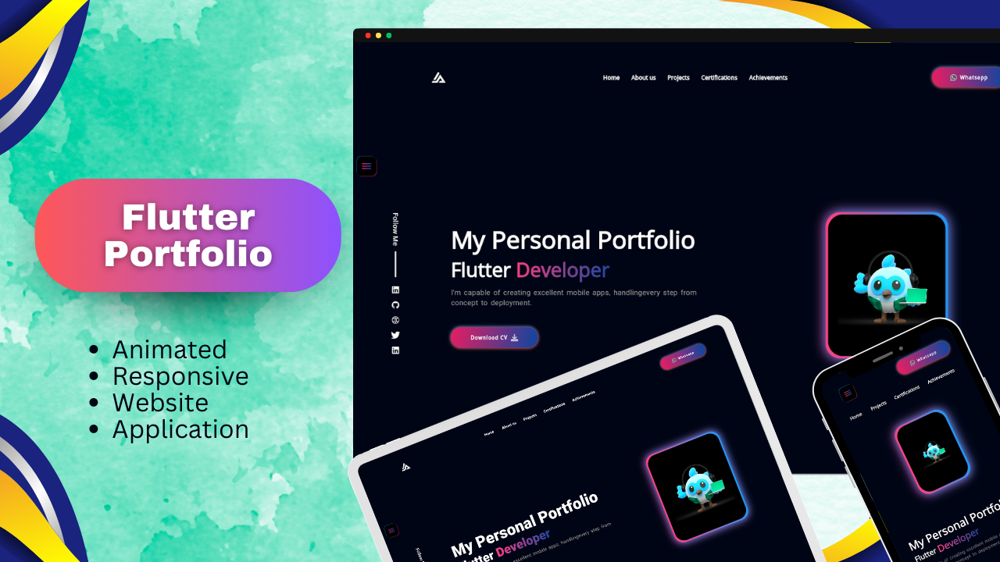

# Responsive Flutter Portfolio Application & Website

Thank you for visiting my portfolio website repository. This Flutter-based website serves as a showcase of my skills, projects, certifications, and ways to get in touch with me. The website is designed with a strong focus on responsiveness, ensuring that it looks and works flawlessly across a range of devices, from large desktop screens to compact Android devices.

## Live Demo

You can explore the live version of the website [Click to see live demo](https://hamad-anwar.github.io/Portfolio/#/).

## Screenshots

## Table of Contents

- [Key Features](#key-features)
- [Technologies and Packages Used](#technologies-and-packages-used)
- [Getting Started](#getting-started)
- [Usage Guide](#usage-guide)
- [Contributions](#contributions)
- [Contact Me](#contact-me)
- [License](#license)

## Key Features

- **Responsive Design:** The portfolio website is meticulously designed to provide a consistent and visually pleasing experience across a wide variety of devices. Whether you're accessing the website on a large desktop screen, a laptop, a tablet, or a small Android smartphone, the layout and content will adapt gracefully to ensure optimal usability.

- **Project Showcase:** The heart of the portfolio lies in its project showcase. Each project is presented with a captivating card that provides a glimpse of the project's essence. Visitors have the option to click on these cards to delve deeper into the details of each project. Furthermore, a direct link to the corresponding GitHub repository allows visitors to explore the codebase and gain a comprehensive understanding of the project's technical aspects.

- **Certifications and Achievements:** I believe in continuous learning and growth, which is why the portfolio features a dedicated section showcasing my certifications and achievements. This provides insight into my professional journey, highlighting the skills and expertise I've acquired along the way.

- **Contact and Interaction:** To facilitate easy communication, the portfolio provides multiple avenues to get in touch with me. The contact section features information such as my email address, LinkedIn profile, and Twitter handle. Whether you're a potential collaborator, an employer, or just someone interested in connecting, I'm always open to meaningful conversations.

- **Elegant UI and Animations:** The user interface of the portfolio is thoughtfully designed to not only be functional but also visually appealing. Subtle animations are integrated throughout the website to create an engaging and delightful browsing experience. These animations are carefully balanced to enhance user engagement without overwhelming the content.

## Technologies and Packages Used

The portfolio website is built using Flutter, a powerful open-source UI software development toolkit. The following packages were utilized to enhance various aspects of the website:

- [google_fonts](https://pub.dev/packages/google_fonts): Incorporates visually appealing and readable fonts from the Google Fonts library into the website.
- [flutter_svg](https://pub.dev/packages/flutter_svg): Enables the seamless integration and rendering of SVG images, ensuring high-quality graphics across all devices.
- [get](https://pub.dev/packages/get): Empowers efficient state management, simplifying the process of handling and updating UI components.
- [photo_view](https://pub.dev/packages/photo_view): Provides an elegant and user-friendly image viewer for an enhanced visual experience.
- [url_launcher](https://pub.dev/packages/url_launcher): Enables easy integration with external links, allowing visitors to quickly navigate to external resources.
- [font_awesome_flutter](https://pub.dev/packages/font_awesome_flutter): Introduces a wide variety of customizable icons from the FontAwesome library, enhancing the visual representation of the website's features.

## Getting Started

To explore and interact with the portfolio website on your local machine, follow these steps:

1. **Clone the Repository:**
   git clone https://github.com/Hamad-Anwar/Flutter-Responsive-Portfolio-WebApp.git
2. **Install Dependencies:**
   flutter pub get
3. **Run Application**
   flutter run

## Usage Guide

Once the website is up and running, you'll find a range of sections to explore:

- **Home:** The landing page welcomes visitors with an overview of the website's contents and purpose.
- **Projects:** Navigate through my various projects, each displayed as an interactive card. Clicking on a card reveals in-depth information and a direct link to the GitHub repository.
- **Certifications:** Explore my certifications, gaining insight into my professional development journey.
- **Contact:** Reach out to me through provided contact details or social media links.

## Contributions

I welcome contributions and suggestions from the community! If you come across any issues, have ideas for improvements, or wish to contribute in any way, feel free to open an issue or submit a pull request. Let's collaborate to make this portfolio even better!

## Contact Me

Your feedback and thoughts are highly valued. Feel free to connect with me through:

- **Email:** rh676838@gmail.com
- **LinkedIn:** [Hamad Anwar](https://www.linkedin.com/in/hamad-anwar)

## License

This project is licensed under the MIT License - see the [LICENSE](LICENSE) file for details.

---

### Designed and developed with ❤️ by [Hamad Anwar](https://www.linkedin.com/in/hamad-anwar/).
